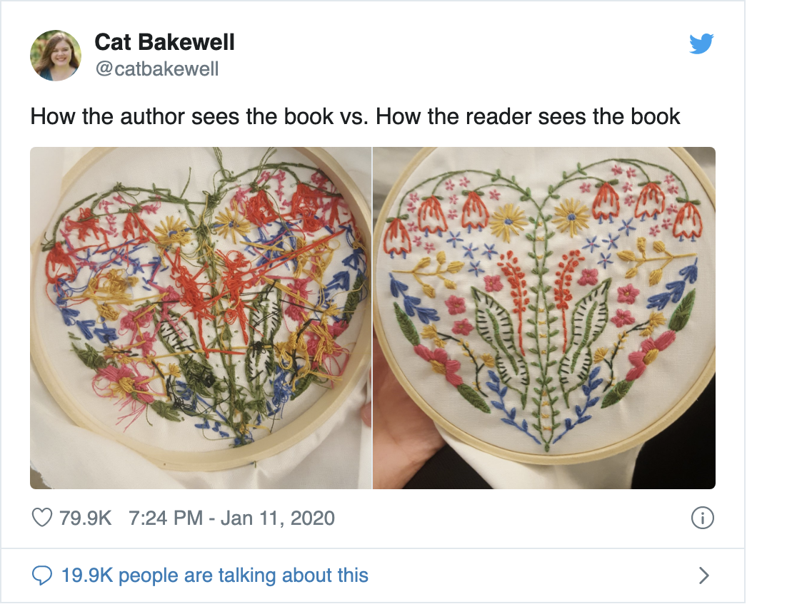
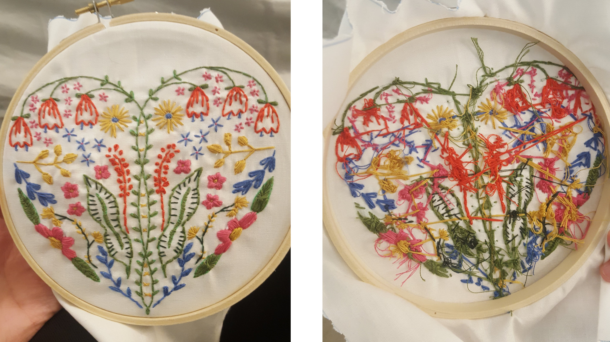

class: title

```{r setup, include=FALSE}
options(htmltools.dir.version = FALSE)
knitr::opts_chunk$set(
  fig.width = 10,
  fig.height = 6,
  fig.retina = 2,
  warning = FALSE,
  message = FALSE
)
source("R/components.R")
xaringanExtra::use_xaringan_extra(c("tile_view", "animate_css", "panelset"))
```

```{r js4shiny, echo=FALSE}
js4shiny::html_setup(stylize = c("fonts", "variables", "code"))
```

`r title_slide("Hello World Wide Web", "JavaScript for Shiny Users")`

---
class: `r CLASS$breaks$js` bottom right

## JS<br>CSS<br>HTML<br>...WTF?

---
name: how-it-works
layout: true

# How does the web work?

???

* Browser requests `rstudio.com`
* gets `rstudio.com/index.html`
* `index.html` says here's the document
* and you also need these other files
* browser reads document structure, styles, javascript
* builds a web page and hands it to you
* what `index.html` says it should be and what the page *is* when you see it are very different

---

`r slides_from_images("assets/img/intro/how-web-works", regexp = ".jpg$", class = "animated fadeIn")`

---
layout: false

`r fullscreen_bg_image("assets/img/intro/color-by-number.png", class = "animated zoomIn")`

???

* HTML tells the browser **what**:
  * content
  * images
  * other files

---
`r fullscreen_bg_image("assets/img/intro/anna-kolosyuk-D5nh6mCW52c-unsplash.jpg")`

???

* CSS tells the browser **how** to show things to you

---
`r fullscreen_bg_image("assets/img/intro/alice-achterhof-FwF_fKj5tBo-unsplash.jpg", position = "0 -50px")`

???

* JavaScript can step in at any point and mess with the whole process

---
name: button-example
class: fullscreen h-100

```{r echo=FALSE}
btn_header <- ".pa2.pl3"
btn_left_col <- ".fl.w-70.pa2.pl3.nt3"
btn_right_col <- ".fr.w-30.pa2.pl3.pt3.nt3"
```

`r btn_header`[
## HTML
]

`r btn_left_col`[
```html
<button id="button-demo" value='0'>
  &#x1F44D; Plus one
</button>
```
]

`r btn_right_col`[
<button value='0'>&#x1F44D; Plus one</button>
]

???

Go through the example twice...
The first time, just showing the basics, focusing on the role of the languages.

The second time, talk through

- connected via `id`
- css controls appearance
  - note: appearance _in states_ so sometimes it feels like it does something but it doesn't change the HTML
- js can change the HTML, change the styles, move things around, react etc.

Finally use last block as quick intro to JS

---
class: fullscreen h-100

`r btn_header`[
## CSS
]

`r btn_left_col`[
```{css}
#button-demo {
  color: #4d8dc9;
  background-color: white;
  border: 2px solid #4d8dc9;
  padding: 0.5em 1em;
}
```
]

<div id="button-demo-no-hover">
`r btn_right_col`[
<button id="button-demo" value='0'>&#x1F44D; Plus one</button>
]
</div>

<style>
  #button-demo-no-hover #button-demo {
    background-color: white;
    border: 2px solid #4d8dc9;
    color: #4d8dc9;
  }
  #button-demo-no-hover #button-demo {
    transform: scale(1);
  }
</style>

---
class: fullscreen h-100

`r btn_header`[
## CSS
]

`r btn_left_col`[

```css
#button-demo {
  color: #4d8dc9;
  background-color: white;
  border: 2px solid #4d8dc9;
  padding: 0.5em 1em;
}
```

```{css}
#button-demo:hover {
  background-color: #4d8dc9;
  color: white;
}
```
]

<div id="button-demo-no-active">
`r btn_right_col`[
<button id="button-demo" value='0'>&#x1F44D; Plus one</button>
]
</div>

<style>#button-demo-no-active #button-demo { transform: scale(1); }</style>

---
class: fullscreen h-100

`r btn_header`[
## CSS
]

`r btn_left_col`[
```css
#button-demo {
  color: #4d8dc9;
  background-color: white;
  border: 2px solid #4d8dc9;
  padding: 0.5em 1em;
}
#button-demo:hover {
  background-color: #4d8dc9;
  color: white;
}
```

```{css}
#button-demo:active {
  transform: scale(0.9);
}
```
]

`r btn_right_col`[
<button id="button-demo" value='0'>&#x1F44D; Plus one</button>
]

---
class: fullscreen h-100

`r btn_header`[
## JS
]

`r btn_left_col`[
```{js eval=FALSE}
const btn = document.getElementById('button-demo')
```
```{js button-demo-js, echo=-1}
const btn = document.querySelector('#button-demo-full #button-demo')
btn.addEventListener('click', function() {
  let clicks = parseInt(btn.value)
  clicks = clicks + 1
  btn.value = clicks
  btn.innerHTML = `&#x1F44D; Plus one (${clicks})`
  console.log('Clicks: ' + clicks)
})
```
]

<div id="button-demo-full">
`r btn_right_col`[
<button id="button-demo" value='0'>&#x1F44D; Plus one</button>
]
</div>

```{js button-demo-js-reset, echo=FALSE}
const btn = document.querySelector('#button-demo-full #button-demo')
const btnConsole = document.querySelector("#out-button-demo-js pre")
btn.addEventListener('click', function() {
  if (parseInt(btn.value) === 13) {
    btn.classList.add('animated')
    btn.classList.add('hinge')
  }
})
slideshow.on('showSlide', () => {
  if (parseInt(btn.value) === 13) {
    btn.classList.remove('animated')
    btn.classList.remove('hinge')
    btn.value = 0
    btn.innerHTML = '&#x1F44D; Plus one'
    btnConsole.innerHTML = ''
  }
})
```

```{css, echo=FALSE}
#out-button-demo-js-reset { display: none; }
```

---
name: motivation
class: `r CLASS$breaks$shiny` huge

# Shiny + .js

.marker.f5[What can we do with Shiny and Javascript?]

---

# Use color to give feedback

.relative.w-100.h-100.ph2[
`r iframe_fullscreen("assets/html/motivate/01-feedback-color.html", scale = 2)`
]

---

# Hold your horses...

.relative.w-100.h-100.ph2[
`r iframe_fullscreen("assets/html/motivate/02-feedback-icon-animation_initial.html", scale = 2)`
]

---

# Waiting is easier with communication

.relative.w-100.h-100.ph2[
`r iframe_fullscreen("assets/html/motivate/02-feedback-icon-animation_solution.html", scale = 2)`
]

---

# Direct attention with animation

.relative.w-100.h-100.ph2[
`r iframe_fullscreen("assets/html/motivate/03-feedback-animation-wiggle.html", scale = 2)`
]

---

# Send messages to your users

.relative.w-100.h-100.ph2[
`r iframe_fullscreen("assets/html/motivate/04-feedback-update-text.html", scale = 2)`
]

---

# Guide users through your app

.relative.w-100.h-100.ph2[
`r iframe_fullscreen("assets/html/motivate/05-control-focus.html", scale = 2)`
]

---

# Add keyboard shortcuts

.relative.w-100.h-100.ph2[
`r iframe_fullscreen("assets/html/motivate/06-control-keyboard-events.html", scale = 2)`
]

---
layout: true

# Make R Markdown awesome-r

---

.panelset[
.panel[.panel-name[pkg-stats.Rmd]

```markdown
## ggplot2 {.pkg-stats}

downloads
:    846k/month

stars
:    4.2k

forks
:    1.5k
```
]

.panel[.panel-name[pkg-stats.html]

```html
<h2 class="pkg-stat" id="ggplot2">ggplot2</h2>
<dl>
  <dt>downloads</dt>
  <dd>846k/month</dd>
  <dt>stars</dt>
  <dd>4.2k</dd>
  <dt>forks</dt>
  <dd>1.5k</dd>
</dl>
```
]


.panel[.panel-name[Browser]

.relative.w-100.h-abs-475[
`r iframe_fullscreen("assets/html/motivate/08-design-rewrite_initial.html", scale = 2)`
]]
]

---

.relative.w-100.h-100.ph2[
`r iframe_fullscreen("assets/html/motivate/08-design-rewrite_solution.html", scale = 1.5)`
]

---
layout: false

# Don't work too hard

.relative.w-100.h-100.ph2[
`r iframe_fullscreen("assets/html/motivate/07-design-add-content.html", scale = 1.5)`
]

---

# Use JavaScript libraries for **fun**

.relative.w-100.h-100.ph2[
`r iframe_fullscreen("assets/html/motivate/09-jslib-typerjs.html", scale = 2)`
]

---

# Use JavaScript libraries for **profit**

.relative.w-100.h-100.ph2[
`r iframe_fullscreen("assets/html/motivate/10-jslib-frappe-charts.html", scale = 1.25)`
]

---

# Use JavaScript libraries for **profit**

.relative.w-100.h-100.ph2[
`r iframe_fullscreen("assets/html/motivate/11-jslib-frappe-charts-extended.html", scale = 1.25)`
]

---
layout: true

# Workshop goals

???

One major reason for focusing on some of the fundamentals is that it's an expected baseline in much of the documentation.

Web people and libraries assume you're going to do web things, as anyone whose asked a shiny specific webdev question on stack overflow knows.

R and Shiny package docs focus on being productive with the tools, not necessarily going deep. _How does anybody learn this?_

Having a solid mental model of what web dev is supposed to be like is super helpful.

---

.w-two-thirds.mh-a[

]

---

.w-80.mh-a[

]


---
class: center middle 

# Next: [Maiden Voyage (How to WWW)](how-to-www.html)
