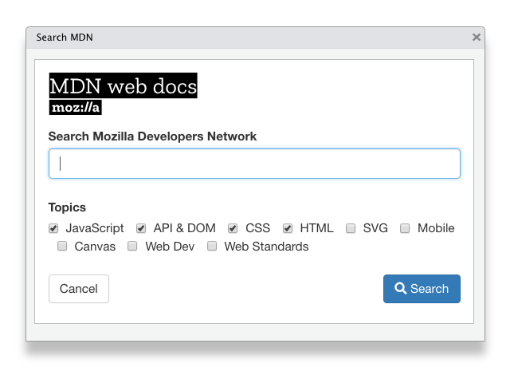
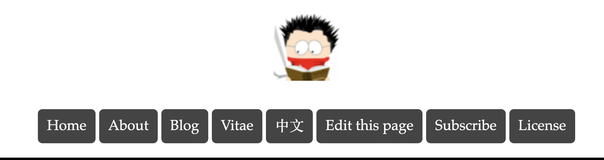
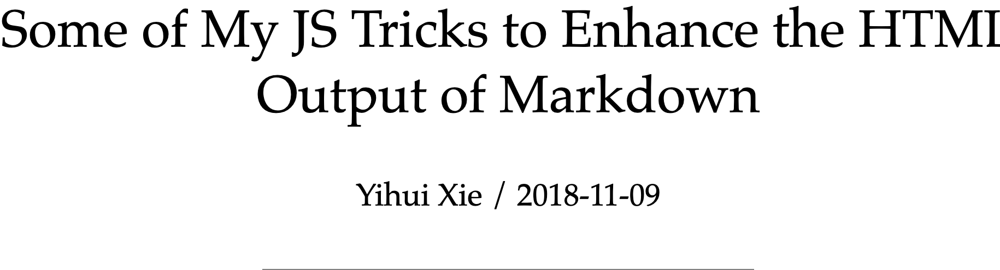
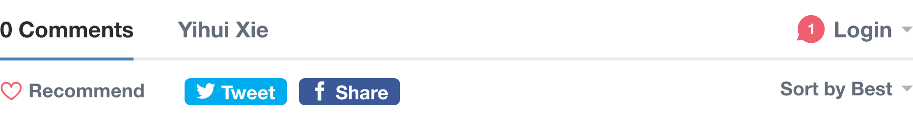
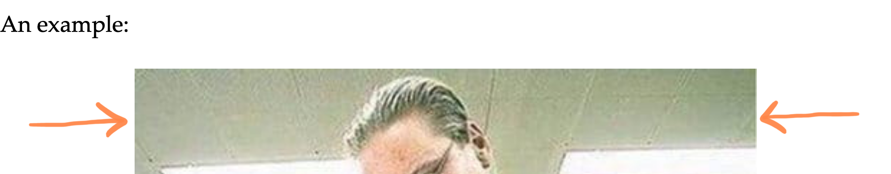
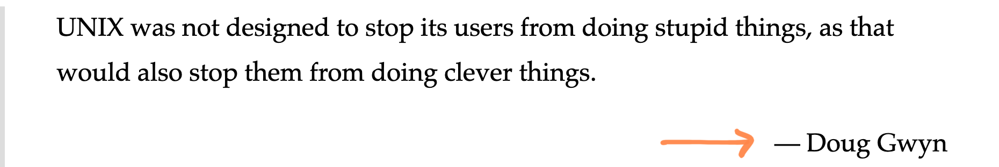
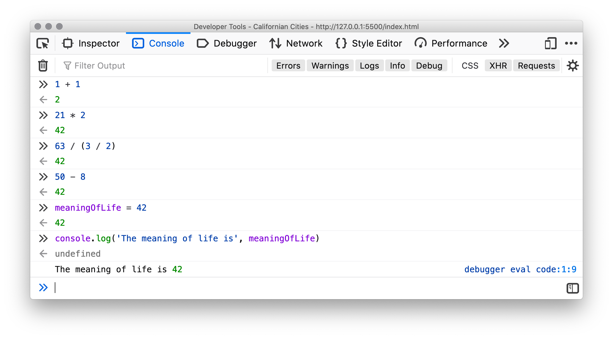

class: title

```{r setup, include=FALSE}
options(htmltools.dir.version = FALSE)
knitr::opts_chunk$set(
  fig.width = 10,
  fig.height = 6,
  fig.retina = 2,
  warning = FALSE,
  message = FALSE
)
use_placeholders(TRUE, TRUE)
source("R/components.R")
xaringanExtra::use_xaringan_extra(c("tile_view", "animate_css", "editable"))
```

```{r js4shiny, echo=FALSE}
js4shiny::html_setup(stylize = c("fonts", "variables", "code"))
```

`r title_slide("Maiden Voyage", "How to Build a Website")`

---

# Anatomy of an HTML Document

.flex[

<div class="w-40 tc white center"><div class="ba bw1 b--black-20 pa1 w-90"><div class="bg-blue w-100 h-a-150 flex flex-column items-center justify-center tc f3">HEAD</div>
<div class="bg-green w-100 h-a-300 flex flex-column items-center justify-center tc f3">BODY</div>
</div>
</div>
]

---
layout: true
background-size: cover
background-position: top-left

# Anatomy of an HTML Document

.flex[

<div class="w-40 tc white center"><div class="ba bw1 b--black-20 pa1 w-90"><div class="bg-blue w-100 h-a-150 flex flex-column items-center justify-center tc f3">HEAD</div>
<div class="bg-green w-100 h-a-300 flex flex-column items-center justify-center tc f3">BODY</div>
</div>
</div>

.w-60.pre-hide-filetype.pre-hide-border[

```{html eval=FALSE}
<!DOCTYPE html>
<html lang="en">
  <head>
    <meta charset="utf-8" />
    <!-- meta -->

    <title>My First Webpage</title>

  </head>
  <body>
    <!-- content -->
  </body>
</html>
```

]
]

---

---
background-image: url('assets/img/intro/html-doc-anatomy/html-doc-anatomy-1.jpg')

---
background-image: url('assets/img/intro/html-doc-anatomy/html-doc-anatomy-2.jpg')

---
background-image: url('assets/img/intro/html-doc-anatomy/html-doc-anatomy-3.jpg')

---
layout: false
class: header_background

# Create an HTML Document

.flex.pt2[
.w-40[
1. Open RStudio

1. New File `r htmlent$triangle_right_small` Text Document

1. .code.purple[first-page/index.html]

1. Add .bigger[&#x1F449;]

1. .silver[Use .code[html5] or .code[html:basic] snippet]

1. Use _Live Preview_ addin
]

.w-60[
```html
<!DOCTYPE html>
<html lang="en">
  <head>
    <meta charset="utf-8" />
    <!-- meta -->

    <title>My First Webpage</title>

  </head>
  <body>
    <!-- content -->
  </body>
</html>
```
]
]

.footnote.code[repl_example("first-page-00")]

???

- https://www.taniarascia.com/basic-html5-file/
- https://html5boilerplate.com/

---
class: header_background

# Add a header to our page

Note that there's no title on the _page_ (it's just the browser window title)

```
<title>My First Webpage</title>
```
--

.mt1.block[&nbsp;]

Change the page title and add an `<h1>` element to the page.

```{html html-title-2, eval=FALSE}
<title>Californian Cities</title>

<!-- ... -->

<body>
  <h1>Median Resident Age</h1>
</body>
```

---
class: header_background

# Add some content to your page

.bigger[
```{html html-body, eval=FALSE, name="first-page/index.html"}
<body>
  <h1>Median Resident Age</h1>
  <div><!-- chart will go here --></div>
  <h2>San Francisco</h2>
  <p>
    The median age of the residents of
    <strong>San Francisco</strong>
    is <strong>38.8</strong> years old.
  </p>
</body>
```

]

---

## Our First Page

You should have something that looks like 1993

.relative.w-100.h-75.ph2[
`r iframe_fullscreen("assets/html/first-page/index.html", scale = 1.5)`
]

<!--
.html-preview.html-plain.serif[
<h1>Californian Cities</h1>
<h2>San Francisco</h2>
<p>
  The median age of the residents of <strong>San Francisco</strong>
  is <strong>38.8</strong> years old.
</p>
]
-->

---
layout: false
# HTML is a tree

```{json html-tree, echo=FALSE}
{
  head: {
    meta: {charset: "UTF-8"},
    title: "Californian Cities"
  },
  body: {
    h1: ['Californian Cities'],
    h2: ['San Francisco'],
    p: [
      'The median age of residents...',
      {strong: 'San Francisco'},
      'is',
      {strong: '38.8'},
      'years old'
    ]
  }
}
```

```{css echo=FALSE}
#json-html_tree .jv__json-size {
  display: none;
}
```

---
layout: true
# Browsers: The RStudio IDE of Web Dev

---

.flex[
.w-10[
&nbsp;
]

.w-40[
.w-40.center[

]
.f5.center[Firefox]

.center[
.b[Win] <kbd>Ctrl</kbd> + <kbd>Shift</kbd> + <kbd>I</kbd>

.b[Mac] <kbd>Cmd</kbd> + <kbd>Opt</kbd> + <kbd>I</kbd>
]
]

.w-40.cr[
.w-40.center[

]
.f5.center[Chrome]

.center[
.b[Win] <kbd>Ctrl</kbd> + <kbd>Shift</kbd> + <kbd>C</kbd>

.b[Mac] <kbd>Cmd</kbd> + <kbd>Opt</kbd> + <kbd>C</kbd>
]
]
]

???

 - **Firefox**:
  - Windows/Linux: <kbd>Ctrl</kbd> + <kbd>Shift</kbd> + <kbd>I</kbd> or <kbd>F12</kbd>
  - Mac: <kbd>Cmd</kbd> + <kbd>Opt</kbd> + <kbd>I</kbd>
  - <https://developer.mozilla.org/en-US/docs/Tools>
- **Chrome**:
  - Windows/Linux: <kbd>Ctrl</kbd> + <kbd>Shift</kbd> + <kbd>C</kbd>
  - Mac: <kbd>Cmd</kbd> + <kbd>Opt</kbd> + <kbd>C</kbd>
  - <https://developers.google.com/web/tools/chrome-devtools/>
- **Safari**:
  - Enable: _Safari_ > _Preferences_ > _Advanced_ > _Show Develop menu in menu bar_
  - Right-click + _Inspect Element_
  - <https://support.apple.com/guide/safari/use-the-developer-tools-in-the-develop-menu-sfri20948/mac>
- **RStudio**:
  - Right-click + _Inspect Element_

---

.flex[
.w-third[
.w-40.center[

]
.f5.center[Firefox]

.center[
.b[Win] <kbd>Ctrl</kbd> + <kbd>Shift</kbd> + <kbd>I</kbd>

.b[Mac] <kbd>Cmd</kbd> + <kbd>Opt</kbd> + <kbd>I</kbd>
]
]

.w-third[
.w-40.center[

]
.f5.center[Chrome]

.center[
.b[Win] <kbd>Ctrl</kbd> + <kbd>Shift</kbd> + <kbd>C</kbd>

.b[Mac] <kbd>Cmd</kbd> + <kbd>Opt</kbd> + <kbd>C</kbd>
]
]

.w-third[
.w-40.center.mt2[

]
.tc[
.f5[RStudio]

 .code.bg-black-10.ph2.black-60[Inspect Element]
]
]
]

---
layout: false
`r slides_from_images("assets/img/intro/html-tree", regexp = "jpg$", class = "")`

---
layout: false
# HTML Tag Rules

.center.f6.black-50[
<p>rstudio::conf <em>rocks</em> &#x1F918;</p>
]

.center.code.f6[
.red[&lt;p&gt;]rstudio::conf&nbsp;.green[&lt;em&gt;]rocks.green[&lt;/em&gt;]&nbsp;.silver[&amp;\#x].blue[1F918];.red[&lt;/p&gt;]
]

---

`r slides_from_images("assets/img/intro/html-tag-rules", regexp = "0[13].jpg$", class = "animated fadeIn")`

---
layout: true
`r slides_from_images("assets/img/intro/html-tag-rules", regexp = "04.jpg$", class = "center bottom")`

---
<!-- first image pointing to open/close -->
---

.mb5.bigger[
.red[&lt;tag&gt;]
.light-silver[&nbsp;&hellip;&nbsp;]
.red[&lt;/tag&gt;]
]

---

.mb5.bigger[
.red[&lt;parent&gt;]
.light-silver[&nbsp;&hellip;&nbsp;]
.green[&lt;child&gt;]
.light-silver[&nbsp;&hellip;&nbsp;]
.green[&lt;/child&gt;]
.light-silver[&nbsp;&hellip;&nbsp;]
.red[&lt;/parent&gt;]
]

--

.absolute.bottom-2.huge.pb2[
&#x2705;
]

---

.mb5.bigger[
.red[&lt;parent&gt;]
.light-silver[&nbsp;&hellip;&nbsp;]
.green[&lt;child&gt;]
.light-silver[&nbsp;&hellip;&nbsp;]
.red[&lt;/parent&gt;]
.light-silver[&nbsp;&hellip;&nbsp;]
.green[&lt;/child&gt;]
]

--

.absolute.bottom-2.huge.pb2[
&#x1F6AB;
]

---
layout: false

`r slides_from_images("assets/img/intro/html-tag-rules", regexp = "[^1234].jpg$", class = "animated fadeIn")`

---
class: center middle

# Escaped HTML Characters

.bigger[
&rarr; [toptal.com/designers/htmlarrows](https://www.toptal.com/designers/htmlarrows/)

&#x1F913; [gadenbuie/ermoji](https://github.com/gadenbuie/ermoji)
]

---
layout: true

.flex.pt4[
<div class="w-40 center h2">Block</div>

<div class="w-20 center h2 silver">vs</div>

<div class="w-40 center h2">Inline</div>
]

---

`r slides_from_images("assets/img/intro/block-vs-inline", class = "animated fadeIn")`

---
layout: false
`r slides_from_images("assets/img/intro/block-vs-inline/block-vs-inline-6.jpg", class = "animated fadeIn")`

.flex.pt4[
<div class="w-40 center h2"><span class="code blue">&lt;div&gt;</span></div>

<div class="w-20 center h2 silver">vs</div>

<div class="w-40 center h2"><span class="code purple">&lt;span&gt;</span></div>
]

---
layout:true
class: header_background

# Tag Detective: Block or Inline?

.center.code.f3.red[&#x1F575; [bit.ly/yihui-js-tricks](https://bit.ly/yihui-js-tricks)]

---

```{r tag-detective-names, echo=FALSE}
tags <- c(
  "section" = "&#x2195;&#xFE0F;",
  "nav" = "&#x2195;&#xFE0F;",
  "header" = "&#x2195;&#xFE0F;",
  "article" = "&#x2195;&#xFE0F;",
  "h2" = "&#x2195;&#xFE0F;",
  "blockquote" = "&#x2195;&#xFE0F;",
  "pre" = "&#x2195;&#xFE0F;",
  "ul" = "&#x2195;&#xFE0F;",
  "strong" = "&#x2194;&#xFE0F;",
  "em" = "&#x2194;&#xFE0F;",
  "code" = "&#x2194;&#xFE0F;",
  "a" = "&#x2194;&#xFE0F;",
  "img" = "&#x2194;&#xFE0F;",
  "li" = "&#x2194;&#xFE0F;"
)
tags <- glue::glue("- .answer[{unname(tags)}] .code[&lt;{names(tags)}&gt;]")
tags_rand <- sample(tags)
tags_1 <- tags_rand[1:7]
tags_2 <- setdiff(tags_rand, tags_1)
```

.flex.hide-answer[
.w-50[
`r paste(tags_1, collapse = "\n\n")`
]

.w-50[
`r paste(tags_2, collapse = "\n\n")`
]
]

`r countdown::countdown(4, warn_when = 30, play_sound = "assets/libs/countdown/smb_stage_clear.mp3")`

???

Task is to go find these elements in Yihui's blog post
and determine if they are block or inline elements.

Also: what type of content is inside each tag?

---

.flex[
.w-50[
`r paste(tags_1, collapse = "\n\n")`
]

.w-50[
`r paste(tags_2, collapse = "\n\n")`
]
]

???

Any trouble finding any of these tags?

* Demonstrate searching in browser dev tools

* Show **Layout** tab

---
layout: false

# Common Tags

.pull-left[
### Structure (Block)

`r paste(tags[1:8], collapse = "\n\n")`
]

.pull-right[
### Markup (Inline)

`r paste(setdiff(tags, tags[1:8]), collapse = "\n\n")`.red[&ast;&ast;]

.pt2[
Many, many more elements:<br> .code[[bit.ly/mdn-html-elements](http://bit.ly/mdn-html-elements)]
]
]

???

Note that `<li>` is a little different (it's `inline-block`)

All of these are more expressive than `<div>` and `<span>`


---
class: center middle

## Searching MDN

.flex[
<div class="w-50 tc bigger"><span class="icon icon-25 icon-rstudio"></span><span class="ml1 dark-blue">RStudio</span></div>

<div class="w-50 tc bigger">&#x1F4E6; <span class="ml1 code red">js4shiny</span></div>
]



---
layout: false
exclude: true

# Common Inline Tags for Formatting

| Tag           |     Markdown      | Description                        |
| ------------- | :---------------: | ---------------------------------- |
| .code[strong] | .code[&ast;&ast;] | <strong>Bold</strong> text         |
| .code[em]     |       &#95;       | <em>Italic</em> text               |
| .code[code]   |  .code[&grave;]   | Inline .code[code] snippet         |
| .code[q]      |                   | Short <q>inline quotation</q>      |
| .code[mark]   |                   | <mark>Highlighted</mark> text      |
| .code[kbd]    |                   | <kbd>Ctrl</kbd> + <kbd>Shift</kbd> |

---
`r fullscreen_bg_image("assets/img/bg/unsplash_0gSXazNJJ90.jpg", class = "break center middle")`

## .dark-blue[HTML Attributes]

---
exclude: true

* Notice class, id, etc. in Yihui's page
* Tags have attributes, e.g. `<a>`
* All tags can have a `class`, an `id`, and/or `style`
    * `id`: unique identifier
    * `class`: this kind of thing
    * `style`: make this one thing look like this (use as a last resort)
    * `id` and `class` are useful when trying to _find_ or _change appearance_ of an element.
* Examples
    * `<header class="title">`
    * `<h2 id="how-to-work-with-mathjax">`
    * `<p style="text-align: center;">`
* **TASK** update our page
    * What parts of the page should change?
    * What parts of the page should get special treatment?

---
layout: true

# HTML Attributes: Extra Information

Some HTML elements **require** attributes to be functional

---

.code.f5[
&lt;a&gt;js4shiny.com&lt;/a&gt;
]

.f4[
<a>js4shiny.com</a>
]

---

.code.f5[
&lt;a&nbsp;.red[href=]"https:&#8203;//js4shiny&#8203;.com"&gt;<br>&nbsp;&nbsp;js4shiny.com<br>&lt;/a&gt;
]

.f4[
<a href="https://js4shiny.com" target="_blank">js4shiny.com</a>
]

---
layout: false

# HTML Attributes: .code[class]

The .code.red[class] attribute differentiates between similar elements

--

.absolute.right-0.w-40[

]
.code.f5[
&lt;header&nbsp;.blue[class]=".purple[masthead]"&gt;
]

<div class="h-25"></div>

--

.absolute.right-1.w-40[

]
.code.f5[
&lt;header&nbsp;.blue[class]=".orange[title]"&gt;
]

---
layout: false

# HTML Attributes: .code[id]

The .code.red[id] attribute .red[identifies] individual elements

--

.code.f5[
&lt;h2&nbsp;.red[id]=".blue[how-to-work-with-mathjax]"&gt;
]


--

.code.f5[
&lt;div&nbsp;.red[id]=".green[disqus_thread]"&gt;
]



---

# HTML Attributes: .code[style]

The .code.red[style] attribute changes the appearance of _just one element_

--

.code.f6[
&lt;p&nbsp;.red[style]=".blue[text-align:&nbsp;center;]"&gt;
]

.w-60.center[

]

--

.code.f6[
&lt;p&nbsp;.red[style]=".blue[text-align:&nbsp;right;]"&gt;
]

.w-60.center[

]

---
layout: true
class: center top

# The Most Important<br>HTML Attributes

---

.f4.mha[
<table>
<tbody>
  <tr>
    <td class="tr pr2"><span class="code">class</span></td>
    <td class="tl pl2 pa2">this <span class="b dark-pink">kind</span> of thing</td>
  </tr>
  <tr>
    <td class="tr pr2"><span class="code">id</span></td>
    <td class="tl pl2 pa2">this <span class="b dark-green">one</span> thing</td>
  </tr>
  <tr>
    <td class="tr pr2"><span class="code">style</span></td>
    <td class="tl pl2 pa2">my <span class="b blue">special</span> thing</td>
  </tr>
</tbody>
</table>
]

---

.f4.mha[
<table>
<tbody>
  <tr>
    <td class="tr pr2"><span class="code">class</span></td>
    <td class="tl pl2 pa2">this <span class="b dark-pink">kind</span> of thing</td>
  </tr>
  <tr>
    <td class="tr pr2"><span class="code">id</span></td>
    <td class="tl pl2 pa2">this <span class="b dark-green">one</span> thing</td>
  </tr>
  <tr>
    <td class="tr pr2 o-40"><span class="code">style</span></td>
    <td class="tl pl2 pa2 o-40">my <span class="b blue">special</span> thing</td>
  </tr>
  <tr>
    <td class="tr pr2"><span class="code">data-</span></td>
    <td class="tl pl2 pa2">hold my <span class="b gold">data</span></td>
  </tr>
</tbody>
</table>
]

---
layout: false
class: header_background

# Add ids and classes to our web page


Which items do we want to style similarly or can we find at **once**? `r htmlent$right_arrow_heavy` `class`

Which items do we need to find, knowing that we'll only get **one**? `r htmlent$right_arrow_heavy` `id`

--

**Add the following classes or ids:**

- `city`

- `age`

- `chart`

- `city-header`

- `city-text`

`r countdown::countdown(1, 0)`

.footnote[.code[repl_example("first-page-01")]]

---
layout: false
name: css
class: break white
background-image: url('assets/img/bg/unsplash_p6p5-uR5N5U.jpg')
background-size: cover

.w-50[
# .f-galada[Cascading Style Sheets]
]

---

## What is it?

&#x1F440; A set of **rules** that define how your webpage looks

???

HTML is supposed to be about content and structure
but as soon as you start laying out the content
the boundary between CSS and HTML seems odd.

It's really a dance between HTML and CSS.

--

## What does it do?

&#x1F3A8; If HTML is .b[content], then CSS is **presentation**

Typography, color, adjust position and size, borders, shadows, and more

--

## Where does it go?

- Inside `<style>` tags anywhere

- In a `.css` file that is included with a special `<link>` tag inside `<head>`

- (In `<tag style = "">`)

---

# HTML and CSS: A Coordinated Dance

--

.center[

]

---
layout: true

# CSS Rules

There are two main components of a CSS rule.

1. The **selector** defines which elements on the page match the rule

1. The **property list** set properties of those elements to specific values.

---

.code.f6.w-50.mh-a.mt4[
.purple[selector] {<br>
.ml4[.dark-green[property]: .blue[value];]<br>
.ml4[.dark-green[property]: .blue[value];]<br>
}
]

---

.code.f6.w-50.mh-a.mt3[
.purple[selector-one],<br>
.purple[selector-two] {<br>
.ml4[.dark-green[property]: .blue[value];]<br>
.ml4[.dark-green[property]: .blue[value];]<br>
}
]

---
layout: true

# Selecting Elements with CSS

.f6.code.center[
&lt;.red.bg-washed-red[h1] class=".dark-blue.bg-washed-blue[page-title]" id=".dark-green.bg-washed-green[title]" &gt;
]

---

---

`r slides_from_images("assets/img/intro/css-selectors-basic", regexp = "jpg$", class = "")`


---
layout: true
class: header_background

# Give our page some style &#x1F576;&#xFE0F;

---

.flex[

.w-60[
- Give headings the `color: #466683;`

- City names get `background: #55ebbc;`

- The median age gets `background: #f6e995;`

- Style the chart so that it is

    - `800px` wide

    - `250px` high

    - has a `2px solid #c0c9cc` border
]

.w-40[
.mha.mt3[
<table>
<thead>
  <tr>
    <th class="tl pr2 pv2">Selector</th>
    <th class="tr pl2">By</th>
  </tr>
</thead>
<tbody>
  <tr>
    <td class="tl pr2 pv2"><span class="code red">h1</span></td>
    <td class="tr pl2">element</td>
  </tr>
  <tr>
    <td class="tl pr2 pv2"><span class="code dark-blue">.page-title</span></td>
    <td class="tr pl2">class</td>
  </tr>
  <tr>
    <td class="tl pr2"><span class="code dark-green">#title</span></td>
    <td class="tr pl2 pv2">id</td>
  </tr>
</tbody>
</table>
]
]
]

.footnote.code[repl_example("first-page-02")]

---

Let's use a good set of fonts: [systemfontstack.com](https://systemfontstack.com)

```css
body {
 font-family: -apple-system, BlinkMacSystemFont, avenir next, avenir,
   helvetica neue, helvetica, Ubuntu, roboto, noto, segoe ui, arial,
   sans-serif;
}
```

???

Go to the systemfontstack website and copy and paste, it's super easy.

--

Changing the `body` font changes all the fonts; this is the _cascade_.

---
layout: false
class: header_background

# The Best Part of CSS: variables.sup.moon-gray[*]

.flex[
.w-50[
```css
:root {
  --dark-blue: #466683;
  --grey: #c0c9cc;
  --green: #55ebbc;
  --yellow: #f6e995;
}
```
]
.w-50[
```css
h1,
h2 {
  color: var(--dark-blue);
}
.city {
  background: var(--green);
}
.age {
  background: var(--yellow);
}
#chart {
  border: 2px solid var(--gray)
}
```
]
]

.footnote[.silver.sup[*] Also sometimes called _custom properties_]

---
layout: false
class: header_background

# Wrap the City Header in a .code[span]

.big[
Replace our current HTML

```html
<h2 id="city-header" class="city">San Francisco</h2>
```

with this

```html
<h2>
  <span id="city-header" class="city">San Francisco</span>
</h2>
```
]

---
layout: false
class: break break-javascript right bottom
background-image: url('assets/img/bg/unsplash_Xh6BpT-1tXo.jpg')
background-size: cover

<h1 id="javascript" class="rotate-350 text-shadow-2" style="margin-bottom: 35px"><span class="bigger">JavaScript</span></h1>

---
class: header_background

# Find The JavaScript Console in Dev Tools



???

Firefox: <kdb>Cmd + Alt + K</kdb>

---
layout: true

<h1 class="mb1">Like  R, But Different</h1>

.flex.w-100[
.w-50.mr5[
<h2 class="mv1 tc bb bw1">R</h2>
]
.w-50[
<h2 class="mv1 tc bb bw1">JavaScript</h2>
]
]

---

.flex.w-100[
.w-50.mr5[
- `+`, `-`, `*`, `/`, `**`

- `x <- 2` or `x = 2`

- Assign/declare at once<br>&nbsp;

- Comments — `# comment`
]
.w-50[
- `+`, `-`, `*`, `/`, `**`

- `x = 2`

- Declare variables with<br>`const`, `let`, `var`

- Comments — `// comment` or

    ```
    /*
     * mutliline comments
     */
    ```
]
]

---

.flex.w-100[
.w-50.mr5[
- Numbers — `1.234`

- Integers — `1L`

- Strings — `"apple"` or `'banana'`<br>&nbsp;

- Boolean — `TRUE` or `FALSE`

- Arrays — `c(1, 2, 3)`

- Lists — `list(a = 1, b = 2)`
]
.w-50[
- Numbers — `1.234`

- ~~Integers~~ — &#x261D;

- Strings — `'apple'`, `"banana"` or .code.dark-blue.backtick[${fruit}]

- Boolean — `true` or `false`

- Arrays — `[1, 2, 3]`

- Objects — `{a: 1, b: 2}`
]
]

---

.flex.w-100[
.w-50.mr5[
- Missing — `NA`

- `NULL`

- `NaN`, `Inf`, `-Inf`
]
.w-50[
- Undefined — `undefined`

- `null`

- `NaN`, `Infinity`, `-Infinity`
]
]


---

.flex.w-100[
.w-50.mr5[
- Functions — `message("hello")`

- Methods — `print.tbl()`
]
.w-50[
- Functions — `alert('hello')`

- Methods — `console.log()`
]
]

.w-50[
If R worked like JavaScript, every `tibble` would carry around it's own print function.
]


---
layout: false

# What kind of variable am I?

.flex.w-100[
.w-50.mr3[
<h3 class="mv1 tc bb bw1">Won't Change</h3>

```{js js-const-demo}
const x = 42
x = 64
```
]

.w-50[
<h3 class="mv1 tc bb bw1">Could Change</h3>

```{js js-let-demo}
let x = 42
x = 64
x
```
]
]

--

.flex[
.w-50.mr3[
<h3 class="mv1 tc bb bw1">Old School</h3>

```{js js-var-demo}
var x = 42
x = 48
x
```
]

.w-50[
<h3 class="mv1 tc bb bw1">Don't Overthink</h3>

.dark-green.big[`r htmlent$done`] Use `const` or `let`

.red.big[`r htmlent$x`] Don't replace a `const` variable

.red.big[`r htmlent$x`] Don't worry
]
]

---

<h1 id="this-slide-title">JavaScript Runs in the Browser</h1>

The browser builds the document from an internal model **DOM**

Made available to JavaScript via **document**

The methods of `document` let you interact with the browser

--

```{js getElementById}
// Find an element in your page by ID
let title = document.getElementById('this-slide-title')

// Once you have the element...
title.textContent
```

---
layout: false

# JavaScript Runs in the Browser

.flex[
.w-50.mr3[
<h3 class="mv1 tc bb bw1">Find Elements</h3>

.code.silver[document.red[.getElementById()]]

.code.silver[document.red[.querySelector()]]

.code.silver[document.red[.querySelectorAll()]]
]
.w-50[
<h3 class="mv1 tc bb bw1">Modify Elements</h3>

.code.silver[el.red[.textContent]]

.code.silver[el.red[.innerHTML]]

.code.silver[el.red[.style].blue[.color]]
]
]

--

.flex[
.w-50.mr3[
.code.red[document] is the name of the object<br>from the browser's API
]

.w-50[
.code.red[el] is a variable name and<br>can (or should!) get a better name
]
]

--

Let's change **San Francisco** `r htmlent$right_arrow_big` **Los Angeles**

---
layout: false
class: header_background

# In the developer tools console...

.big[
1. Change the median age to 35.9

1. Change the background color of the chart placeholder to match the border color (`var(--gray)`)
]

`r countdown::countdown(1, 30)`

---
layout: false

# A more permanent solution

--

Obviously, we can't stand next to our users and ask to type code into their browser console

--


---

## Where to Write JavaScript Code

### Write right inside your HTML

```html
<script>
  // JavaScript ...
</script>
```

<h3 class="mb1">Write in a separate file</h3>

```{js eval=FALSE, name="script.js"}
alert('hello rstudio::conf')
```

```{html eval=FALSE, name="index.html"}
<script src="script.js"></script>
```

---
layout: true

## Where to Put Your JavaScript Code

<div class="w-40 tc white"><div class="ba bw1 b--black-20 pa1 w-90"><div class="bg-blue w-100 h-a-150 flex flex-column items-center justify-center tc f3">HEAD</div>
<div class="bg-green w-100 h-a-300 flex flex-column items-center justify-center tc f3">BODY</div>
</div>
</div>

---

---

`r slides_from_images("assets/img/intro/js-script-where-html", regexp = "jpg$", class = "")`

---
layout: false
class: header_background

# Make it official

```html
<script>
  let city = 'Los Angeles';
  let age = 38.8;
  document.getElementById('city-header').textContent = city;
  document.getElementById('city-text').textContent = city;
  document.querySelector('#age').textContent = age;

  let chart = document.getElementById('chart');
  chart.style.background = 'var(--gray)';
</script>
```

Put this `<script>` just before the `<style>` we added earlier.

`r countdown::countdown(2)`

.footnote.code[repl_example("first-page-03")]

???

Follow up questions, activity

1. What happens if you move the script to the top of the `<body>`?
2. How can you find out if your code has errors?

---

# R Markdown is Awesome

You can do all of this in R Markdown, too.

```{r js4shiny-rmd-new, eval=FALSE}
# Open a new, empty plain html R markdown
js4shiny::js4shiny_rmd("plain")
```

.flex.w-100[
.w-50[
- Put the HTML in the document

- Copy the JavaScript into a js chunk

    ````markdown
    ```{js}`r ''`
    let city = 'Los Angeles'
    // ...
    ```
    ````
]
.w-50[
- Copy the CSS into  a `css` chunk

    ````markdown
    ```{css}`r ''`
    .city {
      background: var(--green);
    }
    .age {
      background: var(--yellow);
    }
    ```
    ````
]
]

???

Hey, it works in `rmarkdown::html_document()` too.

---

# Summary

.can-edit.key-summary[
- HTML is a tree, called the DOM
- HTML tags have a name, attributes, and contents
- HTML for content, CSS for presentation
- CSS selectors
- CSS in `<style>` or `.css`
- JavaScript is like R but different
- JavaScript runs in the browser
- JavaScript manipulates the DOM
]

---


# HTML Resources

* Mastering Shiny: Advanced UI<br>
  https://mastering-shiny.org/advanced-ui.html

* FrontEnd Masters Handbook<br>
  https://frontendmasters.com/books/front-end-handbook/2019/

* Interneting is Hard<br>
  https://internetingishard.com/

* HTML Semantics Cheat Sheet<br>
  https://learn-the-web.algonquindesign.ca/topics/html-semantics-cheat-sheet/

---
class: center middle

# Next: [Ghost in the Machine (Interactivity)](interactivity.html)
