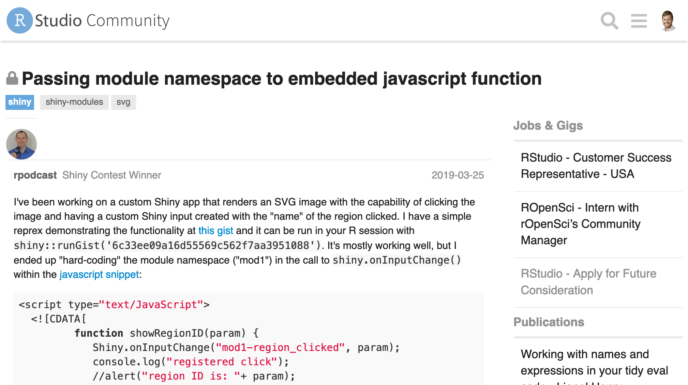
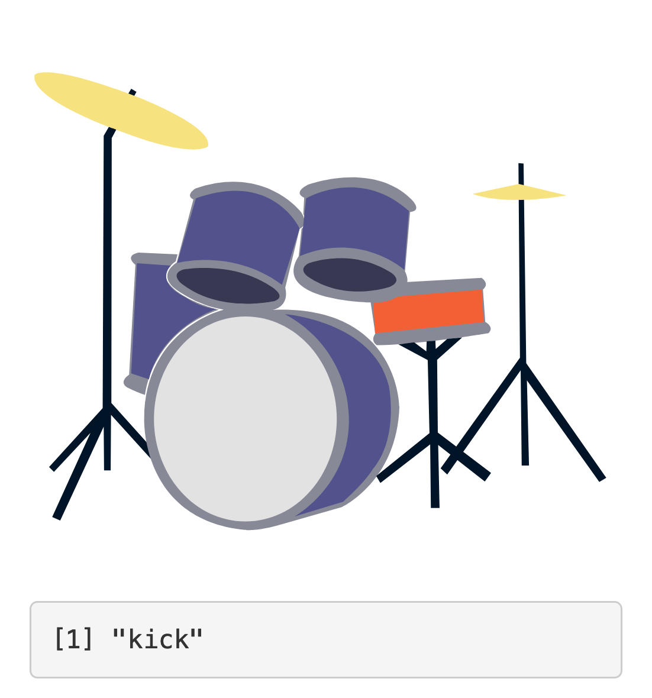

class: title

```{r setup, include=FALSE}
options(htmltools.dir.version = FALSE)
knitr::opts_chunk$set(
  fig.width = 10,
  fig.height = 6,
  fig.retina = 2,
  warning = FALSE,
  message = FALSE
)
source("R/components.R")
use_placeholders(iframes = FALSE)
xaringanExtra::use_xaringan_extra(c("tile_view", "animate_css"))

knitr::knit_engines$set(repl_iframe = function(options) {
  out <- repl_iframe(
    code = paste(options$code, collapse = "\n"),
    scale = options$repl_scale,
    class = options$repl_class
  )
  
  options$results <- "asis"
  options$echo <- getOption("iframe_placeholder", FALSE)
  knitr::engine_output(options, options$code, out)
})
```

```{r js4shiny, echo=FALSE}
js4shiny::html_setup(stylize = c("fonts", "variables", "code"))
```

`r title_slide("Bringing it All Back Home", "R for Web Dev", session = "pm")`

---
class: break white center middle
background-image: url('assets/img/bg/unsplash_VEOk8qUl9DU.jpg')
background-size: cover

## Other Conferences

---
class: break white middle right
background-image: url(assets/img/r-for-web/animal.gif)
background-size: cover

### rstudio::conf

---

## Serious Inspiration

.flex.w-100[
.w-33[
<a href="https://maya-gans.shinyapps.io/human_body_app/"></a>
]

.w-60.ml4[
Inspired by the [Human Body App](https://maya-gans.shinyapps.io/human_body_app/) by Maya Gans.

Also inspired by 
[this question by Eric Nantz](https://community.rstudio.com/t/passing-module-namespace-to-embedded-javascript-function/26988)<br>
on RStudio Community.

.w-80[

]
]
]

---
layout: true

## Our App

.fl.w-33.mr3[


[gadenbuie.shinyapps.io/&#8203;js4shiny-drumkit/](https://gadenbuie.shinyapps.io/js4shiny-drumkit/)
]

---

---

.f5[
_Makes real sounds!_
]

--

.f5[
_Entertaining for at least 5 minutes!_
]

--

.f5[
_It's actually educational!_
]


--

.f5[
_It's a real .f-galada.fs-normal[Shiny] app!_
]


---
layout: false

## To Get Started

.f6[.b[Follow Along:] .code[bit.ly/js4shiny-drumkit]]

.f6[.b[Starter Zip:] .code[bit.ly/js4shiny-drumkit-project]]

```{r, eval=FALSE}
library(usethis)

zip <- "http://bit.ly/js4shiny-drumkit-project"

use_course(zip, destdir = "js4shiny")
```

Use your workshop folder for `destdir`

.absolute.w-20.h-50.bottom-0.right-2[

]

???

[Dev Script](http://bit.ly/js4shiny-drumkit)

---

# Let's Do This Together!

We're going to do all the steps of this project together.

Be kind to your neighbors and help them if they get stuck.

.mt3[
# Read with me...

<a class="f4" href="https://bit.ly/js4shiny-drumkit" target="_blank">bit.ly/js4shiny-drumkits</a>

The **dev journal** is to help if you get lost

Click on .blue[changelog links] to see changes at each step

.code[js4shiny::repl_example("drumkit-N")]
]
