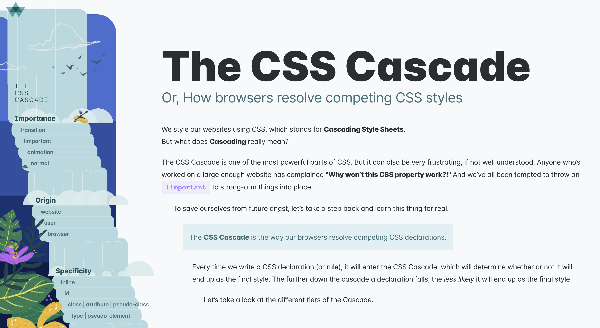

class: title

```{r setup, include=FALSE}
options(htmltools.dir.version = FALSE)
knitr::opts_chunk$set(
  fig.width = 10,
  fig.height = 6,
  fig.retina = 2,
  warning = FALSE,
  message = FALSE
)
source("R/components.R")
use_placeholders()
xaringanExtra::use_xaringan_extra(c("tile_view", "animate_css"))
```

```{r js4shiny, echo=FALSE}
js4shiny::html_setup(stylize = c("fonts", "variables", "code"))
```

`r title_slide("Look Sharp!", "Style with CSS", session = "am")`

---
exclude: true
class: break fullscreen center top huge
background-image: url('assets/img/bg/unsplash_wn-KYaHwcis.jpg')
background-size: cover

# Review

---
class: header_background

# Quick Review: Block v Inline

.f5.mt4[
Which type of display doesn't have a width or height?
]

--

.f5.mt3[
Which type of display is shown on its own line?
]

--

.f5[
What are some examples of **inline** elements?
]

--

.f5[
Examples of **block** elements?
]

---
layout: true

# Display

---

.flex[
.w-50.f6[
```css
.not-down {
*  display: block;
  background: red;
  color: white;
}
```

```html
<p class="not-down">
  ...never gonna...
</p>
```
]
.w-50[

He sings the songs that remind him of the good times.
He sings the songs that remind him of the best times.

Oh, Danny Boy.

.bg-red.white[
I get knocked down, but I get up again. 
You're never gonna to keep me down.
]

]
]


---

.flex[
.w-50.f6[
```css
.best {
* display: inline;
  background: red;
  color: white;
}
```

```html
<span class="best">
  the best times
</span>
```
]
.w-50[

He sings the songs that remind him of the good times.
He sings the songs that remind him of .bg-red.white[the best times].

Oh, Danny Boy.

I get knocked down, but I get up again. 
You're never gonna to keep me down.

]
]


---

.flex[
.w-50.f6[
```css
.danny {
* display: none;
  background: red;
  color: white;
}
```

```html
<p class="danny">
  Oh Danny Boy
</span>
```
]

.w-50[

He sings the songs that remind him of the good times.
He sings the songs that remind him of the best times.


<div style="display: none;">Oh, Danny Boy.</div>

I get knocked down, but I get up again. 
You're never gonna to keep me down.
]

]

---
layout: false
class: fullscreen break white right bottom animated slideInDown slideOutDown
background-image: url('assets/img/bg/unsplash_2aIYMoayjtY.jpg')
background-size: cover

.mb5.mr3[
# CSS Box Model
]

---
class: center middle animated slideInDown

# Everything is (in) a box

## [js4shiny.com/box-size](https://js4shiny.com/box-size)

???

- Focus on the **parts of the box**

---
layout: false

# Border and Shorthand Properties

.f5.code[border: 1px solid turquoise;]

--

.f5[
```
border-width: 1px;
border-style: solid;
border-color: turquoise;
```
]

---
layout: true

# Margin and Padding

---

.flex[
.w-50[
.f5.code[margin: 1em;]
.f5[
```
margin-top: 1em;
margin-right: 1em;
margin-bottom: 1em;
margin-left: 1em;
```
]
]
.w-50[
.f5.code[padding: 1em;]
.f5[
```
padding-top: 1em;
padding-right: 1em;
padding-bottom: 1em;
padding-left: 1em;
```
]
]
]


---

.flex[
.w-50[
.f5.code[margin: 0 1em;]
.f5[
```
margin-top: 0;
margin-right: 1em;
margin-bottom: 0;
margin-left: 1em;
```
]
]
.w-50[
.f5.code[padding: 0 1em;]
.f5[
```
padding-top: 0;
padding-right: 1em;
padding-bottom: 0;
padding-left: 1em;
```
]
]
]

---

.flex[
.w-50[
.f5.code[margin: 1em 0;]
.f5[
```
margin-top: 1em;
margin-right: 0;
margin-bottom: 1em;
margin-left: 0;
```
]
]
.w-50[
.f5.code[padding: 1em 0;]
.f5[
```
padding-top: 1em;
padding-right: 0;
padding-bottom: 1em;
padding-left: 0;
```
]
]
]

---

.flex[
.w-50[
.f6.code[margin: .small[1px 2px 3px 4px;]]
.f5[
```
margin-top: 1px;
margin-right: 2px;
margin-bottom: 3px;
margin-left: 4px;
```
]
]
.w-50[
.f6.code[padding: .small[1px 2px 3px 4px;]]
.f5[
```
padding-top: 1px;
padding-right: 2px;
padding-bottom: 3px;
padding-left: 4px;
```
]
]
]


---
layout: true

## Earlier we saw

---

```{html, html_raw = FALSE}
<p style="text-align: center">
  
</p>
```

--

Is `` inline or block?

---
layout: true

# Image is _inline_ but we can make it _block_

---

```{html, eval=FALSE, html_raw = FALSE}
<p style="text-align: center">
  
</p>
```

???

What will happen?

---

```{html, html_raw = FALSE}
<p style="text-align: center">
  
</p>
```

---

```{html kitten-block-img, html_raw = FALSE}
<p style="text-align: center">
  
</p>
```

```{css}
#out-kitten-block-img :hover {
  background: var(--washed-red);
  outline: 1px solid var(--red);
}
```

---

```{html, html_raw = FALSE, eval=FALSE}
<div class="kitten-container">
  <div class="kitten"></div>
</div>
```

---

.small[
```{html, html_raw = FALSE}
<div class="kitten-container">
  <div class="kitten"></div>
</div>
```
]

```{css echo=TRUE}
.kitten {
  margin: 0 auto;
  height: 200px;
  width: 200px;
  background: url('http://placekitten.com/200/200');
}
```

```{css echo=FALSE}
.kitten-container:hover {
  background-color: var(--washed-red);
}
.kitten-container .kitten:hover {
  outline: 2px solid var(--red);
}
```

---
layout: false

.f2.f-marker.tc[
Center Text
]

.flex.h-50[
.w-50.mh-a.f6[
```css
.centered {
  text-align: center
}
```
]

.w-40[
.w-100.ba.bw1.b--silver.tc[
<div class="red mh-a f3">meow</div>
]
]
]


---
layout: true

.f2.f-marker.tc[
Center Block
]

---

.flex.h-50[
.w-50.mh-a.f6[
```css
.centered {
  display: block;
  width: 33%;
  margin-left: auto;
  margin-right: auto;
}
```
]

.w-40[
.w-100.h-50.ba.bw1.b--silver.flex.items-center[
<div class="w-33 h-100 bg-red mh-a"></div>
]
]
]

---

.flex.h-50[
.w-50.mh-a.f6[
```css
.centered {
  display: block;
  width: 33%;
  margin: 0 auto;
}
```
]

.w-40[
.w-100.h-50.ba.bw1.b--silver.flex.items-center[
<div class="w-33 h-100 bg-red mh-a"></div>
]
]
]

---
layout: false
class: center middle animated lightSpeedIn


---

.f2.f-marker.tc[
Vertical Center
]

.flex.h-50[
.w-60.mh-a.f6[
```css
.container-of-item {
  display: flex;
  align-items: center;
}
```
]

.w-40[
.w-100.h-100.ba.bw1.b--silver.flex.items-center[
<div class="w-20 h-25 bg-red"></div>
]
]
]

---

.f2.f-marker.tc[
All Center
]

.flex.h-50[
.w-60.mh-a.f6[
```css
.container-of-item {
  display: flex;
  align-items: center;
  justify-content: center;
}
```
]

.w-40[
.w-100.h-100.ba.bw1.b--silver.flex.items-center.justify-center[
<div class="w-20 h-25 bg-red"></div>
]
]
]


---
exclude: true
layout: false
class: header_background

# Your Turn

Basic markdown styling:

1. margin around header elements

---
class: break fullscreen break-shiny animated slideInLeft
background-image: url('assets/img/bg/unsplash_cqvy_cag4gI.jpg')
background-size: cover

# CSS Selectors

---
exclude: true

| Separator | Example Selector                  |
| :-------: | :-------------------------------- |
| No space  | `p.shiny`                         | 
|   Space   | <code>.shiny&nbsp;p</code>        |
|    `>`    | <code>.shiny&nbsp;>&nbsp;p</code> |
|    `+`    | <code>.shiny&nbsp;+&nbsp;p</code> |
|    `~`    | <code>.shiny&nbsp;~&nbsp;p</code> |

---
class: animated fadeIn fast

# Joining Selectors

```{html, eval=FALSE}
<div class="card card-eyeshadow">
  <header>
    <div class="pan">
      <div class="shade almost-there"></div>
    </div>
    <h1 id="item">Super Shock Shadow</h1>
  </header>
  <p>By <em class="brand">Colourpop</em></p>
  <div id="cost" class="us-dollar">$8</div>
</div>
```

--

<div class="super-shock-shadow-preview"></div>

```{css echo=FALSE}
.super-shock-shadow-preview {
  background-image: url(assets/img/style/super-shock-shadow-sketch.jpg);
  width: 300px;
  height: 400px;
  background-size: contain;
  background-repeat: no-repeat;
  position: absolute;
  bottom: 10px;
  right: 100px;
}
```

---

# Multiple Rules

.f5.code[h1, p]

.code.silver[
&lt;div&nbsp;class="card&nbsp;card-eyeshadow"&gt;<br>
&nbsp;&nbsp;&lt;header&gt;<br>
&nbsp;&nbsp;&nbsp;&nbsp;&lt;div&nbsp;class="pan"&gt;<br>
&nbsp;&nbsp;&nbsp;&nbsp;&nbsp;&nbsp;&lt;div&nbsp;class="shade&nbsp;almost-there"&gt;&lt;/div&gt;<br>
&nbsp;&nbsp;&nbsp;&nbsp;&lt;/div&gt;<br>
.dark-gray[&nbsp;&nbsp;&nbsp;&nbsp;&lt;h1&nbsp;id="item"&gt;Super&nbsp;Shock&nbsp;Shadow&lt;/h1&gt;<br>]
&nbsp;&nbsp;&lt;/header&gt;<br>
.dark-gray[&nbsp;&nbsp;&lt;p&gt;By&nbsp;&lt;em&nbsp;class="brand"&gt;Colourpop&lt;/em&gt;&lt;/p&gt;<br>]
&nbsp;&nbsp;&lt;div&nbsp;id="cost" class="us-dollar"&gt;$8&lt;/div&gt;<br>
&lt;/div&gt;
]

---

# Same Element

.f5.code[div#cost.us-dollar]

.code.silver[
&lt;div&nbsp;class="card&nbsp;card-eyeshadow"&gt;<br>
&nbsp;&nbsp;&lt;header&gt;<br>
&nbsp;&nbsp;&nbsp;&nbsp;&lt;div&nbsp;class="pan"&gt;<br>
&nbsp;&nbsp;&nbsp;&nbsp;&nbsp;&nbsp;&lt;div&nbsp;class="shade&nbsp;almost-there"&gt;&lt;/div&gt;<br>
&nbsp;&nbsp;&nbsp;&nbsp;&lt;/div&gt;<br>
&nbsp;&nbsp;&nbsp;&nbsp;&lt;h1&nbsp;id="item"&gt;Super&nbsp;Shock&nbsp;Shadow&lt;/h1&gt;<br>
&nbsp;&nbsp;&lt;/header&gt;<br>
&nbsp;&nbsp;&lt;p&gt;By&nbsp;&lt;em&nbsp;class="brand"&gt;Colourpop&lt;/em&gt;&lt;/p&gt;<br>
.dark-gray[&nbsp;&nbsp;&lt;.red[div]&nbsp;id=".green[cost]" class=".blue[us-dollar]"&gt;$8&lt;/div&gt;<br>]
&lt;/div&gt;
]

---
layout: true

# Descendent of

---

.f5.code[header .pan]

.code.silver[
&lt;div&nbsp;class="card&nbsp;card-eyeshadow"&gt;<br>
&nbsp;&nbsp;&lt;.red[header]&gt;<br>
.dark-gray[&nbsp;&nbsp;&nbsp;&nbsp;&lt;div&nbsp;class=".green[pan]"&gt;<br>]
.dark-gray[&nbsp;&nbsp;&nbsp;&nbsp;&nbsp;&nbsp;&lt;div&nbsp;class="shade&nbsp;almost-there"&gt;&lt;/div&gt;<br>]
.dark-gray[&nbsp;&nbsp;&nbsp;&nbsp;&lt;/div&gt;<br>]
&nbsp;&nbsp;&nbsp;&nbsp;&lt;h1&nbsp;id="item"&gt;Super&nbsp;Shock&nbsp;Shadow&lt;/h1&gt;<br>
&nbsp;&nbsp;&lt;/header&gt;<br>
&nbsp;&nbsp;&lt;p&gt;By&nbsp;&lt;em&nbsp;class="brand"&gt;Colourpop&lt;/em&gt;&lt;/p&gt;<br>
&nbsp;&nbsp;&lt;div&nbsp;id="cost" class="us-dollar"&gt;$8&lt;/div&gt;<br>
&lt;/div&gt;
]

---

.f5.code[.card-eyeshadow .pan]

.code.silver[
&lt;div&nbsp;class="card&nbsp;.red[card-eyeshadow]"&gt;<br>
&nbsp;&nbsp;&lt;header&gt;<br>
.dark-gray[&nbsp;&nbsp;&nbsp;&nbsp;&lt;div&nbsp;class=".green[pan]"&gt;<br>]
.dark-gray[&nbsp;&nbsp;&nbsp;&nbsp;&nbsp;&nbsp;&lt;div&nbsp;class="shade&nbsp;almost-there"&gt;&lt;/div&gt;<br>]
.dark-gray[&nbsp;&nbsp;&nbsp;&nbsp;&lt;/div&gt;<br>]
&nbsp;&nbsp;&nbsp;&nbsp;&lt;h1&nbsp;id="item"&gt;Super&nbsp;Shock&nbsp;Shadow&lt;/h1&gt;<br>
&nbsp;&nbsp;&lt;/header&gt;<br>
&nbsp;&nbsp;&lt;p&gt;By&nbsp;&lt;em&nbsp;class="brand"&gt;Colourpop&lt;/em&gt;&lt;/p&gt;<br>
&nbsp;&nbsp;&lt;div&nbsp;id="cost" class="us-dollar"&gt;$8&lt;/div&gt;<br>
&lt;/div&gt;
]

---

.f5.code[.card .shade]

.code.silver[
&lt;div&nbsp;class="card&nbsp;card-eyeshadow"&gt;<br>
&nbsp;&nbsp;&lt;header&gt;<br>
&nbsp;&nbsp;&nbsp;&nbsp;&lt;div&nbsp;class="pan"&gt;<br>
&nbsp;&nbsp;&nbsp;&nbsp;&nbsp;&nbsp;&lt;div&nbsp;class="shade&nbsp;almost-there"&gt;&lt;/div&gt;<br>
&nbsp;&nbsp;&nbsp;&nbsp;&lt;/div&gt;<br>
&nbsp;&nbsp;&nbsp;&nbsp;&lt;h1&nbsp;id="item"&gt;Super&nbsp;Shock&nbsp;Shadow&lt;/h1&gt;<br>
&nbsp;&nbsp;&lt;/header&gt;<br>
&nbsp;&nbsp;&lt;p&gt;By&nbsp;&lt;em&nbsp;class="brand"&gt;Colourpop&lt;/em&gt;&lt;/p&gt;<br>
&nbsp;&nbsp;&lt;div&nbsp;id="cost" class="us-dollar"&gt;$8&lt;/div&gt;<br>
&lt;/div&gt;
]

---

.f5.code[.card .shade]

.code.silver[
&lt;div&nbsp;class=".red[card]&nbsp;card-eyeshadow"&gt;<br>
&nbsp;&nbsp;&lt;header&gt;<br>
&nbsp;&nbsp;&nbsp;&nbsp;&lt;div&nbsp;class="pan"&gt;<br>
.dark-gray[&nbsp;&nbsp;&nbsp;&nbsp;&nbsp;&nbsp;&lt;div&nbsp;class=".green[shade]&nbsp;almost-there"&gt;&lt;/div&gt<br>]
&nbsp;&nbsp;&nbsp;&nbsp;&lt;/div&gt;<br>
&nbsp;&nbsp;&nbsp;&nbsp;&lt;h1&nbsp;id="item"&gt;Super&nbsp;Shock&nbsp;Shadow&lt;/h1&gt;<br>
&nbsp;&nbsp;&lt;/header&gt;<br>
&nbsp;&nbsp;&lt;p&gt;By&nbsp;&lt;em&nbsp;class="brand"&gt;Colourpop&lt;/em&gt;&lt;/p&gt;<br>
&nbsp;&nbsp;&lt;div&nbsp;id="cost" class="us-dollar"&gt;$8&lt;/div&gt;<br>
&lt;/div&gt;
]

---
layout: true

# Direct child of

---

.f5.code[.card > div]

.code.silver[
&lt;div&nbsp;class=".red[card]&nbsp;card-eyeshadow"&gt;<br>
&nbsp;&nbsp;&lt;header&gt;<br>
&nbsp;&nbsp;&nbsp;&nbsp;&lt;div&nbsp;class="pan"&gt;<br>
&nbsp;&nbsp;&nbsp;&nbsp;&nbsp;&nbsp;&lt;div&nbsp;class="shade&nbsp;almost-there"&gt;&lt;/div&gt;<br>
&nbsp;&nbsp;&nbsp;&nbsp;&lt;/div&gt;<br>
&nbsp;&nbsp;&nbsp;&nbsp;&lt;h1&nbsp;id="item"&gt;Super&nbsp;Shock&nbsp;Shadow&lt;/h1&gt;<br>
&nbsp;&nbsp;&lt;/header&gt;<br>
&nbsp;&nbsp;&lt;p&gt;By&nbsp;&lt;em&nbsp;class="brand"&gt;Colourpop&lt;/em&gt;&lt;/p&gt;<br>
.dark-gray[&nbsp;&nbsp;&lt;.green[div]&nbsp;id="cost" class="us-dollar"&gt;$8&lt;/div&gt;<br>]
&lt;/div&gt;
]

---

.f5.code[p > .brand]

.code.silver[
&lt;div&nbsp;class="card&nbsp;card-eyeshadow"&gt;<br>
&nbsp;&nbsp;&lt;header&gt;<br>
&nbsp;&nbsp;&nbsp;&nbsp;&lt;div&nbsp;class="pan"&gt;<br>
&nbsp;&nbsp;&nbsp;&nbsp;&nbsp;&nbsp;&lt;div&nbsp;class="shade&nbsp;almost-there"&gt;&lt;/div&gt;<br>
&nbsp;&nbsp;&nbsp;&nbsp;&lt;/div&gt;<br>
&nbsp;&nbsp;&nbsp;&nbsp;&lt;h1&nbsp;id="item"&gt;Super&nbsp;Shock&nbsp;Shadow&lt;/h1&gt;<br>
&nbsp;&nbsp;&lt;/header&gt;<br>
&nbsp;&nbsp;&lt;p&gt;By&nbsp;&lt;em&nbsp;class="brand"&gt;Colourpop&lt;/em&gt;&lt;/p&gt;<br>
&nbsp;&nbsp;&lt;div&nbsp;id="cost" class="us-dollar"&gt;$8&lt;/div&gt;<br>
&lt;/div&gt;
]

---

.f5.code[p > .brand]

.code.silver[
&lt;div&nbsp;class="card&nbsp;card-eyeshadow"&gt;<br>
&nbsp;&nbsp;&lt;header&gt;<br>
&nbsp;&nbsp;&nbsp;&nbsp;&lt;div&nbsp;class="pan"&gt;<br>
&nbsp;&nbsp;&nbsp;&nbsp;&nbsp;&nbsp;&lt;div&nbsp;class="shade&nbsp;almost-there"&gt;&lt;/div&gt;<br>
&nbsp;&nbsp;&nbsp;&nbsp;&lt;/div&gt;<br>
&nbsp;&nbsp;&nbsp;&nbsp;&lt;h1&nbsp;id="item"&gt;Super&nbsp;Shock&nbsp;Shadow&lt;/h1&gt;<br>
&nbsp;&nbsp;&lt;/header&gt;<br>
.dark-gray[&nbsp;&nbsp;&lt;.red[p]&gt;By&nbsp;&lt;em&nbsp;class=".green[brand]"&gt;Colourpop&lt;/em&gt;&lt;/p&gt;<br>]
&nbsp;&nbsp;&lt;div&nbsp;id="cost" class="us-dollar"&gt;$8&lt;/div&gt;<br>
&lt;/div&gt;
]

---
layout: false

# Siblings

.f5.code[header ~ #cost]

.code.silver[
&lt;div&nbsp;class="card&nbsp;card-eyeshadow"&gt;<br>
&nbsp;&nbsp;&lt;.red[header]&gt;<br>
&nbsp;&nbsp;&nbsp;&nbsp;&lt;div&nbsp;class="pan"&gt;<br>
&nbsp;&nbsp;&nbsp;&nbsp;&nbsp;&nbsp;&lt;div&nbsp;class="shade&nbsp;almost-there"&gt;&lt;/div&gt;<br>
&nbsp;&nbsp;&nbsp;&nbsp;&lt;/div&gt;<br>
&nbsp;&nbsp;&nbsp;&nbsp;&lt;h1&nbsp;id="item"&gt;Super&nbsp;Shock&nbsp;Shadow&lt;/h1&gt;<br>
&nbsp;&nbsp;&lt;/header&gt;<br>
&nbsp;&nbsp;&lt;p&gt;By&nbsp;&lt;em&nbsp;class="brand"&gt;Colourpop&lt;/em&gt;&lt;/p&gt;<br>
.dark-gray[&nbsp;&nbsp;&lt;div&nbsp;id=".green[cost]" class="us-dollar"&gt;$8&lt;/div&gt;<br>]
&lt;/div&gt;
]

---

# Immediate sibling

.f5.code[header + p]

.code.silver[
&lt;div&nbsp;class="card&nbsp;card-eyeshadow"&gt;<br>
&nbsp;&nbsp;&lt;.red[header]&gt;<br>
&nbsp;&nbsp;&nbsp;&nbsp;&lt;div&nbsp;class="pan"&gt;<br>
&nbsp;&nbsp;&nbsp;&nbsp;&nbsp;&nbsp;&lt;div&nbsp;class="shade&nbsp;almost-there"&gt;&lt;/div&gt;<br>
&nbsp;&nbsp;&nbsp;&nbsp;&lt;/div&gt;<br>
&nbsp;&nbsp;&nbsp;&nbsp;&lt;h1&nbsp;id="item"&gt;Super&nbsp;Shock&nbsp;Shadow&lt;/h1&gt;<br>
&nbsp;&nbsp;&lt;.red[/header]&gt;<br>
.dark-gray[&nbsp;&nbsp;&lt;.green[p]&gt;By&nbsp;&lt;em&nbsp;class="brand"&gt;Colourpop&lt;/em&gt;&lt;/p&gt;<br>]
&nbsp;&nbsp;&lt;div&nbsp;id="cost" class="us-dollar"&gt;$8&lt;/div&gt;<br>
&lt;/div&gt;
]

---
layout: true

# Siblings

---

.f5.code[p ~ div]

.code.silver[
&lt;div&nbsp;class="card&nbsp;card-eyeshadow"&gt;<br>
&nbsp;&nbsp;&lt;header&gt;<br>
&nbsp;&nbsp;&nbsp;&nbsp;&lt;div&nbsp;class="pan"&gt;<br>
&nbsp;&nbsp;&nbsp;&nbsp;&nbsp;&nbsp;&lt;div&nbsp;class="shade&nbsp;almost-there"&gt;&lt;/div&gt;<br>
&nbsp;&nbsp;&nbsp;&nbsp;&lt;/div&gt;<br>
&nbsp;&nbsp;&nbsp;&nbsp;&lt;h1&nbsp;id="item"&gt;Super&nbsp;Shock&nbsp;Shadow&lt;/h1&gt;<br>
&nbsp;&nbsp;&lt;/header&gt;<br>
&nbsp;&nbsp;&lt;p&gt;By&nbsp;&lt;em&nbsp;class="brand"&gt;Colourpop&lt;/em&gt;&lt;/p&gt;<br>
&nbsp;&nbsp;&lt;div&nbsp;id="cost" class="us-dollar"&gt;$8&lt;/div&gt;<br>
&nbsp;&nbsp;&lt;div&nbsp;class="brand-image"&gt;...&lt;/div&gt;<br>
&lt;/div&gt;
]

---

.f5.code[p ~ div]

.code.silver[
&lt;div&nbsp;class="card&nbsp;card-eyeshadow"&gt;<br>
&nbsp;&nbsp;&lt;header&gt;<br>
&nbsp;&nbsp;&nbsp;&nbsp;&lt;div&nbsp;class="pan"&gt;<br>
&nbsp;&nbsp;&nbsp;&nbsp;&nbsp;&nbsp;&lt;div&nbsp;class="shade&nbsp;almost-there"&gt;&lt;/div&gt;<br>
&nbsp;&nbsp;&nbsp;&nbsp;&lt;/div&gt;<br>
&nbsp;&nbsp;&nbsp;&nbsp;&lt;h1&nbsp;id="item"&gt;Super&nbsp;Shock&nbsp;Shadow&lt;/h1&gt;<br>
&nbsp;&nbsp;&lt;/header&gt;<br>
&nbsp;&nbsp;&lt;.red[p]&gt;By&nbsp;&lt;em&nbsp;class="brand"&gt;Colourpop&lt;/em&gt;&lt;/p&gt;<br>
.dark-gray[&nbsp;&nbsp;&lt;.green[div]&nbsp;id="cost" class="us-dollar"&gt;$8&lt;/div&gt;<br>]
.dark-gray[&nbsp;&nbsp;&lt;.green[div]&nbsp;class="brand-image"&gt;...&lt;/div&gt;<br>]
&lt;/div&gt;
]

---

.f5.code[p + div]

.code.silver[
&lt;div&nbsp;class="card&nbsp;card-eyeshadow"&gt;<br>
&nbsp;&nbsp;&lt;header&gt;<br>
&nbsp;&nbsp;&nbsp;&nbsp;&lt;div&nbsp;class="pan"&gt;<br>
&nbsp;&nbsp;&nbsp;&nbsp;&nbsp;&nbsp;&lt;div&nbsp;class="shade&nbsp;almost-there"&gt;&lt;/div&gt;<br>
&nbsp;&nbsp;&nbsp;&nbsp;&lt;/div&gt;<br>
&nbsp;&nbsp;&nbsp;&nbsp;&lt;h1&nbsp;id="item"&gt;Super&nbsp;Shock&nbsp;Shadow&lt;/h1&gt;<br>
&nbsp;&nbsp;&lt;/header&gt;<br>
&nbsp;&nbsp;&lt;p&gt;By&nbsp;&lt;em&nbsp;class="brand"&gt;Colourpop&lt;/em&gt;&lt;/p&gt;<br>
&nbsp;&nbsp;&lt;div&nbsp;id="cost" class="us-dollar"&gt;$8&lt;/div&gt;<br>
&nbsp;&nbsp;&lt;div&nbsp;class="brand-image"&gt;...&lt;/div&gt;<br>
&lt;/div&gt;
]

---

.f5.code[p + div]

.code.silver[
&lt;div&nbsp;class="card&nbsp;card-eyeshadow"&gt;<br>
&nbsp;&nbsp;&lt;header&gt;<br>
&nbsp;&nbsp;&nbsp;&nbsp;&lt;div&nbsp;class="pan"&gt;<br>
&nbsp;&nbsp;&nbsp;&nbsp;&nbsp;&nbsp;&lt;div&nbsp;class="shade&nbsp;almost-there"&gt;&lt;/div&gt;<br>
&nbsp;&nbsp;&nbsp;&nbsp;&lt;/div&gt;<br>
&nbsp;&nbsp;&nbsp;&nbsp;&lt;h1&nbsp;id="item"&gt;Super&nbsp;Shock&nbsp;Shadow&lt;/h1&gt;<br>
&nbsp;&nbsp;&lt;/header&gt;<br>
&nbsp;&nbsp;&lt;.red[p]&gt;By&nbsp;&lt;em&nbsp;class="brand"&gt;Colourpop&lt;/em&gt;&lt;/p&gt;<br>
.dark-gray[&nbsp;&nbsp;&lt;.green[div]&nbsp;id="cost" class="us-dollar"&gt;$8&lt;/div&gt;<br>]
&nbsp;&nbsp;&lt;div&nbsp;class="brand-image"&gt;...&lt;/div&gt;<br>
&lt;/div&gt;
]


---
layout: false

# Beyond Element, ID, Class

| Type            | Example Selector |
| --------------- | ---------------- |
| Element         | `p`              |
| Class           | `.shiny`         |
| IDs             | `#shiny`         |
| Pseudo-classes  | `:hover`, `:active`, `:empty` |
| Attributes      | `[attribute]`    |
| Pseudo-elements | `::before`       |
| Anything        | `*`              |


???

Attribute selectors are awesome and are super helpful 
in tricky situations where you don't have control over
the HTML or the classes (hello shiny!)

---
layout: true

# Attribute Selectors

---

.f5.code[div[id]]

A `<div>` that has an **id** attribute

.code.silver[
&lt;div&nbsp;class="card&nbsp;card-eyeshadow"&gt;<br>
&nbsp;&nbsp;&lt;header&gt;<br>
&nbsp;&nbsp;&nbsp;&nbsp;&lt;div&nbsp;class="pan"&gt;<br>
&nbsp;&nbsp;&nbsp;&nbsp;&nbsp;&nbsp;&lt;div&nbsp;class="shade&nbsp;almost-there"&gt;&lt;/div&gt;<br>
&nbsp;&nbsp;&nbsp;&nbsp;&lt;/div&gt;<br>
&nbsp;&nbsp;&nbsp;&nbsp;&lt;h1&nbsp;id="item"&gt;Super&nbsp;Shock&nbsp;Shadow&lt;/h1&gt;<br>
&nbsp;&nbsp;&lt;/header&gt;<br>
&nbsp;&nbsp;&lt;p&gt;By&nbsp;&lt;em&nbsp;class="brand"&gt;Colourpop&lt;/em&gt;&lt;/p&gt;<br>
.dark-gray[&nbsp;&nbsp;&lt;.red[div]&nbsp;.green[id]="cost" class="us-dollar"&gt;$8&lt;/div&gt;<br>]
&nbsp;&nbsp;&lt;div&nbsp;class="brand-image"&gt;...&lt;/div&gt;<br>
&lt;/div&gt;
]

---

.f5.code[div[id="cost"]]

A `<div>` that has an **id** attribute whose value is **cost**

.code.silver[
&lt;div&nbsp;class="card&nbsp;card-eyeshadow"&gt;<br>
&nbsp;&nbsp;&lt;header&gt;<br>
&nbsp;&nbsp;&nbsp;&nbsp;&lt;div&nbsp;class="pan"&gt;<br>
&nbsp;&nbsp;&nbsp;&nbsp;&nbsp;&nbsp;&lt;div&nbsp;class="shade&nbsp;almost-there"&gt;&lt;/div&gt;<br>
&nbsp;&nbsp;&nbsp;&nbsp;&lt;/div&gt;<br>
&nbsp;&nbsp;&nbsp;&nbsp;&lt;h1&nbsp;id="item"&gt;Super&nbsp;Shock&nbsp;Shadow&lt;/h1&gt;<br>
&nbsp;&nbsp;&lt;/header&gt;<br>
&nbsp;&nbsp;&lt;p&gt;By&nbsp;&lt;em&nbsp;class="brand"&gt;Colourpop&lt;/em&gt;&lt;/p&gt;<br>
.dark-gray[&nbsp;&nbsp;&lt;.red[div]&nbsp;.green[id="cost"] class="us-dollar"&gt;$8&lt;/div&gt;<br>]
&nbsp;&nbsp;&lt;div&nbsp;class="brand-image"&gt;...&lt;/div&gt;<br>
&lt;/div&gt;
]

---

.f5.code[[class*="brand"]]

An element where **brand** appears in the **class** attribute

.code.silver[
&lt;div&nbsp;class="card&nbsp;card-eyeshadow"&gt;<br>
&nbsp;&nbsp;&lt;header&gt;<br>
&nbsp;&nbsp;&nbsp;&nbsp;&lt;div&nbsp;class="pan"&gt;<br>
&nbsp;&nbsp;&nbsp;&nbsp;&nbsp;&nbsp;&lt;div&nbsp;class="shade&nbsp;almost-there"&gt;&lt;/div&gt;<br>
&nbsp;&nbsp;&nbsp;&nbsp;&lt;/div&gt;<br>
&nbsp;&nbsp;&nbsp;&nbsp;&lt;h1&nbsp;id="item"&gt;Super&nbsp;Shock&nbsp;Shadow&lt;/h1&gt;<br>
&nbsp;&nbsp;&lt;/header&gt;<br>
&nbsp;&nbsp;&lt;p&gt;By&nbsp;&lt;em&nbsp;class="brand"&gt;Colourpop&lt;/em&gt;&lt;/p&gt;<br>
&nbsp;&nbsp;&lt;div&nbsp;id="cost" class="us-dollar"&gt;$8&lt;/div&gt;<br>
&nbsp;&nbsp;&lt;div&nbsp;class="brand-image"&gt;...&lt;/div&gt;<br>
&lt;/div&gt;
]

---

.f5.code[[class*="brand"]]

An element where **brand** appears in the **class** attribute

.code.silver[
&lt;div&nbsp;class="card&nbsp;card-eyeshadow"&gt;<br>
&nbsp;&nbsp;&lt;header&gt;<br>
&nbsp;&nbsp;&nbsp;&nbsp;&lt;div&nbsp;class="pan"&gt;<br>
&nbsp;&nbsp;&nbsp;&nbsp;&nbsp;&nbsp;&lt;div&nbsp;class="shade&nbsp;almost-there"&gt;&lt;/div&gt;<br>
&nbsp;&nbsp;&nbsp;&nbsp;&lt;/div&gt;<br>
&nbsp;&nbsp;&nbsp;&nbsp;&lt;h1&nbsp;id="item"&gt;Super&nbsp;Shock&nbsp;Shadow&lt;/h1&gt;<br>
&nbsp;&nbsp;&lt;/header&gt;<br>
&nbsp;&nbsp;&lt;p&gt;By&nbsp;.dark-gray[&lt;em&nbsp;class=".green[brand]"&gt;Colourpop&lt;/em&gt;]&lt;/p&gt;<br>
&nbsp;&nbsp;&lt;div&nbsp;id="cost" class="us-dollar"&gt;$8&lt;/div&gt;<br>
.dark-gray[&nbsp;&nbsp;&lt;div&nbsp;class=".green[brand]-image"&gt;...&lt;/div&gt;<br>]
&lt;/div&gt;
]

---

.f5.center.mt4[
<svg width="200" height="200" class="octicon octicon-mirror" viewBox="0 0 16 16" version="1.1" aria-hidden="true"><path fill-rule="evenodd" d="M15.5 4.7L8.5 0l-7 4.7c-.3.19-.5.45-.5.8V16l7.5-4 7.5 4V5.5c0-.34-.2-.61-.5-.8zm-.5 9.8l-6-3.25V10H8v1.25L2 14.5v-9l6-4V6h1V1.5l6 4v9zM6 7h5V5l3 3-3 3V9H6v2L3 8l3-3v2z"></path></svg>

[bit.ly/mdn-attribute-selectors](http://bit.ly/mdn-attribute-selectors)
]


---
layout: false
class: break animated fadeInDown
background-image: url('assets/img/bg/unsplash_PHB9CK5K7js.jpg')
background-size: cover

<h1 class="mv3">Cascade</h1>

---
class: center

.f4[
[wattenberger.com/blog/css-cascade](https://wattenberger.com/blog/css-cascade)
]



???

We're usually not creating the CSS from scratch,
instead we modify existing CSS to make things look better.

The browser is a jumble of competing CSS rules.

---
class: middle
# When two rules collide...

.flex.pre-hide-filetype.big[
.w-50[
```css
h1 .shiny {
  color: lightblue;
}
```
]
.w-50[
```css
#title.shiny {
  color: red;
}
```
]
]

.h1[...which one wins?]

---
layout: true

# CSS Cascade

---

.left-column[
## Importance
]

.right-column[
What **type** of rule is it?

1. transition

1. `!important`

1. animation

1. **normal**

.flex.pre-hide-filetype.smallish[
.w-50[
```css
.shiny {
  color: lightblue;
}
```
]
.w-50.smallish[
```css
.shiny {
  color: blue !important;
}
```
]
]
]


---

.left-column[
## Importance

## Origin
]

.right-column[
**Where** was the rule defined?

1. website

1. user

1. browser

.flex.pre-hide-filetype[
.w-50[
```css
/* browser default */
p {
  color: black;
}
```
]
.w-50[
```css
/* shiny.css */
p {
  color: lightblue;
}
```
]
]
]


---

.left-column[
## Importance

## Origin

## Specificity
]

.right-column[
How **specific** is the rule?

1. inline styles .fr.code[style="color: lightblue"]

1. id .fr.code[\#shiny]

1. class, attribute, pseudo-class .fr.code[.shiny:hover]

1. element, pseudo-elements .fr.code[strong]

.flex.pre-hide-filetype[
.w-50[
```css
.shiny {
  color: blue;
}
```
]
.w-50[
```css
#shiny {
  color: lightblue;
}
```
]
]
]


---
layout: false

`r slides_from_images("assets/img/style/css-specificity")`

---
layout: true

# CSS Cascade

---

.left-column[
## Importance

## Origin

## Specificity
]

.right-column[
The **most points** on the **highest level** wins

.flex.pre-hide-filetype[
.w-50[
```css
p.shiny {
  color: blue;
}
```
]
.w-50[
```css
.shiny:first-child {
  color: lightblue;
}
```
]
]
]

---

.left-column[
## Importance

## Origin

## Specificity
]

.right-column[
The most points on the highest level wins

Ties can be broken within **specificity** by points one level down

.flex.pre-hide-filetype[
.w-50[
```css
#shiny .paragraph {
  color: blue;
}
```
]
.w-50[
```css
#shiny p {
  color: lightblue;
}
```
]
]
]

---

.left-column[
## Importance

## Origin

## Specificity
]

.right-column[
The most points on the highest level wins

Ties can be broken within specificity by points one level down

How selectors are combined **doesn't matter**

.flex.pre-hide-filetype[
.w-50[
```css
#shiny ~ p {
  color: blue;
}
```
]
.w-50[
```css
#shiny + p {
  color: lightblue;
}
```
]
]
]


---

.left-column[
## Importance

## Origin

## Specificity

## Position
]

.right-column[
Which rule was defined **last**?

.pre-hide-filetype[
```css
.shiny {
  color: blue;
}
```
```css
.shiny {
  color: red;
}
```
]
]

---
layout: false
class: header_background

# Test Your CSS Aim

.center.mt5[
<svg height="128" class="octicon octicon-dashboard octicon-shadow" viewBox="0 0 16 16" version="1.1" width="128" aria-hidden="true"><path fill="var(--purple)" fill-rule="evenodd" d="M9 5H8V4h1v1zm4 3h-1v1h1V8zM6 5H5v1h1V5zM5 8H4v1h1V8zm11-5.5l-.5-.5L9 7c-.06-.02-1 0-1 0-.55 0-1 .45-1 1v1c0 .55.45 1 1 1h1c.55 0 1-.45 1-1v-.92l6-5.58zm-1.59 4.09c.19.61.3 1.25.3 1.91 0 3.42-2.78 6.2-6.2 6.2-3.42 0-6.21-2.78-6.21-6.2 0-3.42 2.78-6.2 6.2-6.2 1.2 0 2.31.34 3.27.94l.94-.94A7.459 7.459 0 008.51 1C4.36 1 1 4.36 1 8.5 1 12.64 4.36 16 8.5 16c4.14 0 7.5-3.36 7.5-7.5 0-1.03-.2-2.02-.59-2.91l-1 1z"></path></svg>

<a class="f3 mt2" href="https://js4shiny.com/css-aim">js4shiny.com/css-aim</a>
]

---
class: center middle

# Next: [Ghost in the Machine (JavaScript)](javascript.html)
