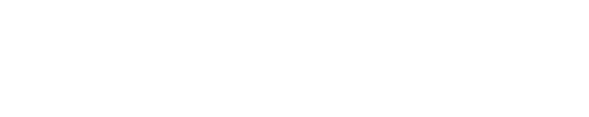
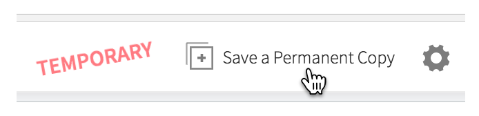
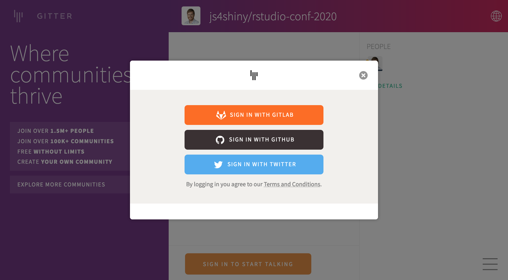
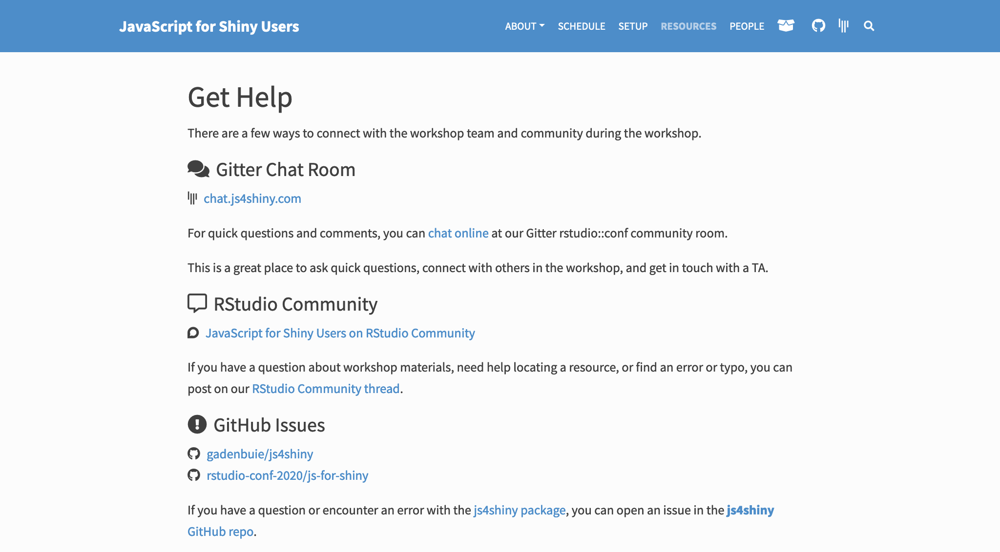
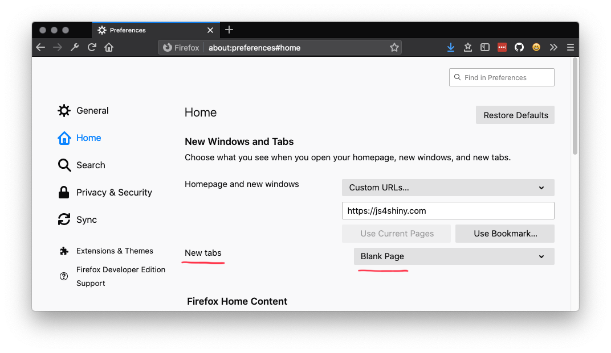

class: break top right
background-image: url(assets/img/bg/unsplash_bpt7mjgrBRQ.jpg)
background-size: cover

<div class="f3 f-nunito w-80 fr mt3">JavaScript for Shiny Users</div>

<div class="f4 white absolute bottom-1 right-2 lh-copy can-edit key-setup">Ready?<br>RStudio Cloud: bit.ly/js4shiny-cloud<br>js4shiny.com/setup</div>

<!--  -->

---
class: title

```{r setup, include=FALSE}
options(htmltools.dir.version = FALSE)
knitr::opts_chunk$set(
  fig.width = 10,
  fig.height = 6,
  fig.retina = 2,
  warning = FALSE,
  message = FALSE
)
source("R/components.R")
xaringanExtra::use_xaringan_extra(c("tile_view", "animate_css", "editable"))
```

```{r js4shiny, echo=FALSE}
js4shiny::html_setup(stylize = c("fonts", "variables", "code"))
```

`r title_slide("Welcome!", "JavaScript for Shiny Users")`

---
exclude: true

# Overview

.pull-left[
- Meet your neighbor
- Meet the team
- Are we ready?
    - everything installed
    - where to find things
    - workshop overview & announcements
- Create a folder for workshop things
]

.pull-right[

]

---
class: break white bottom
background-image: url('assets/img/bg/unsplash_R-WtV-QyVnY.jpg')
background-size: cover

<div class="f1 b mb3 lh-solid">Welcome to <br><span class="fw1 n">rstudio::conf</span>
</div>

---

# Workshop Policies

.w-70[
1. Identify the exits closes to you in case of emergency

1. Please review the .blue[rstudio::conf] code of conduct that applies to all workshops.
   Issues can be addressed in three ways
   
  1. **In person:** contact and .blue[rstudio::conf] staff member 
     or the conference registration desk
       
  1. **By email:** send a message to .code[conf&commat;rstudio.com]
  
  1. **By phone:** call 844—448—1212
  
1. Please do not photograph people wearing .red[red lanyards]

1. A chill-out room is available for neurologically diverse attendees
   on the 4th floor of Tower 1.
]

<div class="icon-rstudio cover absolute bottom-1 right-1" style="width:128px;height:128px"></div>

---

# Meet our team...

.flex.tc[
.w-20.mr3[

.f5[Carson]

.gray[&commat;cpsievert]
]

.w-20.mr3[

.f5[Colin]

.gray[&commat;_ColinFay]
]

.w-20.mr3[

.f5[Garrick]

.gray[&commat;grrrck]
]

.w-20.mr3[

.f5[Maya]

.gray[&commat;Mayacelium]
]

.w-20.mr3[

.f5[Nick]

.small.gray[&commat;NicholasStrayer]
]

]

.tc.f5.gray[
Learn more about us at<br>
js4shiny.com/.dark-blue[people]
]

???

**Carson**:

- sofware engineer at rstudio: shiny, plotly, rmarkdown
- author of _Interactive data visualization with R, plotly, and shiny_
- phd from Iowa State

**Colin**:

- Data scientist and R hacker at ThinkR
- known for: Golem and bubble much much more

**Maya**:

- Creates custom Shiny apps for clinical trials at Cytel
- 2019 Intern at RStudio designed tidyblocks: visual programming language
- Creates awsome inforgraphics for Jambase

**Nick**:

- currently phd candidate in biostats at Vanderbilt
- done data journalism for NYT<br>
  data sci for Jon Hopkins Data Science Lab<br>
  data artist in residence at Conduce
- Blogs at live free or dichotomize
  
  

**Nick**:

- 

---

# Meet your neighbors

.f6[
1. Hi, my name is...

2. What do you do with data and .f-galada.f5[Shiny]?

3. The last thing I looked up on Stack Overflow was...
]

<div class="f1 absolute top-1 right-2 pt0">&#x1F44B;</div>

---
class: break white center top
background-image: url('assets/img/bg/unsplash_6K-xLVV0-wg.jpg')
background-size: cover
background-position: 0 -70px

.mt5[
# Ready?
]

---
class: fullscreen

.flex.w-100.h-100.items-center.justify-center.tc[
.w-33.pb3.mr4[
# WiFi

.f1[&#x1F4F6;]

.code.f4.can-edit.key-wifi-network[rstudio20]
]

.w-33.pb3[
# Password

.f1[&#x1F4BB;]

.code.f4.can-edit.key-wifi-password[tidyverse20]
]
]

---
# Latest **js4shiny**?

.f5.w-70.mh-a.mt4[
```r
devtools::install_github(
  "gadenbuie/js4shiny",
  dependencies = TRUE
)
```

.tc.mt4[
.blue[pkg.]js4shiny.com
]
]

---

# Setup issues, like **npm** problems?

.f5[
Don't worry, you don't need it yet.

Get help with .green[node/npm] between .b[Session 3 and 4].
]

---

# Skip the setup, use rstudio.cloud

.center.mt4[
.f3[[bit.ly/js4shiny-cloud](http://bit.ly/js4shiny-cloud)]


]

---

# Where to find .silver[thing] online?

.tr.w-40.mh-a.f5[
.fl[&#x1F3E0;] [js4shiny.com](https://www.js4shiny.com)

.fl[&#x1F4E6;] [.blue[pkg.].light-silver[js4shiny.com]](https://pkg.js4shiny.com)

.fl[&#x1F4AC;] [.blue[chat.].light-silver[js4shiny.com]](https://chat.js4shiny.com)

.fl[&#x1F64B;] [.blue[help.].light-silver[js4shiny.com]](https://help.js4shiny.com)

.fl[&#x1F5C3;] [.blue[repo.].light-silver[js4shiny.com]](https://repo.js4shiny.com)
]

---

# Share what you're learning

.f6[
&#x1F425; Feel free to tweet about .red[&#35;js4shiny]

&#x1F5E3; Share what you're learning!

&#x1F4F8; Pictures are okay

&#x1F933; Selfies are cool

&#x1F4F9; .red[Please don't video]
]

---

# Sticky Notes

.flex.tc.f5.h4[
.w-33[

<div class="square bg-red mh-a"></div>

I'm stuck!
]

.w-33[

<div class="square bg-yellow mh-a"></div>

I'm not stuck,<br>
but I need &#x1F4BB; help
]

.w-33[

<div class="square mh-a f1 flex justify-center items-center"><span class="bigger ma0 pa0">&#x1F64B;</span></div>

I need help understanding something<br>
.smaller[which likely means others do too!]
]
]

```{css echo=FALSE}
.square {
  width: 200px;
  height: 200px;
}
```

---
class: center

# chat.js4shiny.com



---
class: center

# help.js4shiny.com



---
class: break center middle
background-image: url('assets/img/bg/unsplash_pvMVecxVoW0.jpg')
background-size: cover

<h1 class="dark-gray n">Set?</h1>

---
layout: false
class: header_background

# Browser Check

.flex.h-100.items-center[
.w-third[
.w-40.center[

]
.f5.center[
Firefox
]
]

.w-third[
.w-40.center[

]
.f5.center[
Chrome
]
]

.w-third[
.w-40.center.mt2[

]
.tc.f5[
RStudio
]
]
]

---
class: header_background

# New Tab, Clean Slate

.w-90.mh-a[

]


---
class: header_background

# Setup Home Base

## Make a folder where you can put things

- .mr1[&#x1F4C2;] Create a new folder somewhere **easy to find**
  - not version controlled
  - not inside another project

-  Make an **RStudio project** _inside_ that folder
  - e.g. .pkg[js4shiny-workshop]
  - This will be "homebase"
  - Open this project to get started
 
- .mr1[&#x26C5;] .pkg[bit.ly/js4shiny-cloud]

`r countdown::countdown(1)`
  
???

- Don't version control parent because we'll create more R projects/packages in this folder

---
class: center middle


# How do you like your RStudio?

???

I may need to move my panes around a bit

so let's take a second to see how I have mine set up

---
class: center middle

# Let's Go! &#x1F44B; [Hello, world wide web](hello-www.html)
